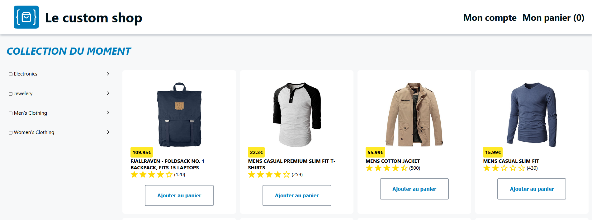

# Custom-store

Visit the custom-store at https://hugofouques.github.io/custom-store/

## Fake Store API

This project uses the [Fake Store API](https://fakestoreapi.com/) to gather all of its data. This means that you need to use credentials recognized by their API to login.

## Run the store locally

### `npm install`

Install the project and download the whole internet to do so.

### `npm start`

Runs the app in the development mode.\
Open [http://localhost:3000](http://localhost:3000) to view it in the browser.

### `npm test`

Launches the test runner in the interactive watch mode.\
See the section about [running tests](https://facebook.github.io/create-react-app/docs/running-tests) for more information.
